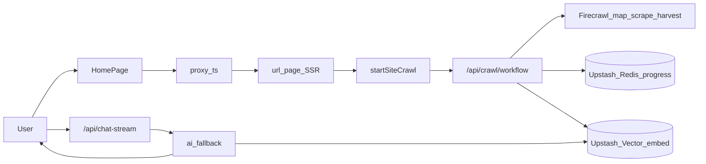
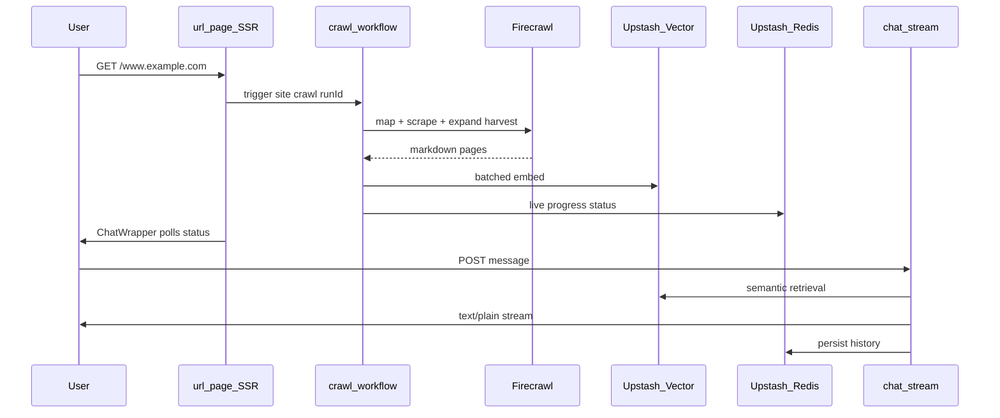

# Website URL RAG Chatbot – Next.js, TypeScript, TailwindCSS, Multi-Provider LLM, Upstash Vector, QStash, Redis Full-Stack Project

[](https://opensource.org/licenses/MIT)
[](https://nextjs.org/)
[](https://react.dev/)
[](https://www.typescriptlang.org/)
[](https://nodejs.org/)
[](https://upstash.com/)
[](https://diploi.com/launch/arnobt78/ai-rag-chatbot)

A modern, full-stack **Website URL RAG Chatbot** — paste any public website URL, **crawl the whole site** with **Firecrawl** (async expand/harvest for FAQs, tabs, dialogs, and toggles), index into **Upstash Vector**, and chat with grounded answers via a **multi-provider LLM fallback chain** (Gemini, Groq, OpenRouter free models, Hugging Face). Built with **Next.js 16**, **React 19**, and **TypeScript**, with live token streaming and Redis-backed session history. Single-page **Jina Reader** remains a fallback when whole-site crawl is not configured.

- **Live-Demo:** [https://scraper-rag-chatbot.vercel.app/www.wikipedia.org](https://scraper-rag-chatbot.vercel.app/www.wikipedia.org)
- **Contributing:** [CONTRIBUTING.md](./CONTRIBUTING.md)
- **Security:** Private reports → [SECURITY.md](./SECURITY.md) · [sohyal57@gmail.com](mailto:sohyal57@gmail.com)
- **Author:** [Mohd Sohyal](https://github.com/sohyal-2) | **GitHub:** [https://github.com/sohyal-2](https://github.com/sohyal-2)


## Table of Contents

- [Project Summary](#project-summary)
- [What You Will Learn](#what-you-will-learn)
- [Core Concepts](#core-concepts)
- [Features](#features)
- [Architecture & Data Flow](#architecture--data-flow)
- [Technology Stack](#technology-stack)
- [Project Structure](#project-structure)
- [Routes & API Endpoints](#routes--api-endpoints)
- [Environment Variables](#environment-variables)
- [Setup & Installation](#setup--installation)
- [Running the Project](#running-the-project)
- [Component Walkthrough](#component-walkthrough)
- [Backend & AI Layer](#backend--ai-layer)
- [Reusing Components in Other Projects](#reusing-components-in-other-projects)
- [Deployment (Vercel)](#deployment-vercel)
- [Troubleshooting](#troubleshooting)
- [Keywords](#keywords)
- [Conclusion](#conclusion)
- [License](#license)

---

## Project Summary

**Website URL RAG Chatbot** is a production-style educational full-stack app that demonstrates how to:

1. **Paste any public URL** → visit `/www.example.com`
2. **Discover and crawl the site** with Firecrawl (map + batched scrape) via Upstash Workflow / QStash
3. **Expand hidden UI** (FAQ accordions, tabs, dialogs, details, read-more) with deterministic harvest scripts before embedding
4. **Chunk and embed** into **Upstash Vector** (built-in `bge-large-en-v1.5` embeddings)
5. **Retrieve relevant context** semantically when the user asks a question
6. **Generate answers** via an LLM with **multi-provider automatic fallback**
7. **Stream tokens** to the browser in real time and **persist chat history** in Redis

If Firecrawl / QStash are not configured, the app falls back to **Jina Reader** single-page ingest so chat still works.

The original Upstash-hosted Llama models (`upstash()` + QStash LLM) were **discontinued in late 2025**. This repo uses external free-tier LLM providers while keeping RAG via `@upstash/rag-chat`.

---

## What You Will Learn

| Topic                                           | Where in this repo                                    |
| ----------------------------------------------- | ----------------------------------------------------- |
| Next.js App Router (Server + Client Components) | `src/app/`, `src/components/`                         |
| Catch-all dynamic routing                       | `src/app/[...url]/page.tsx`                           |
| RAG (Retrieval-Augmented Generation)            | `src/lib/rag-chat.ts`, `@upstash/rag-chat`            |
| Vector databases & semantic search              | Upstash Vector + `ragChat.context.add()`              |
| Whole-site crawl (Firecrawl + Workflow)         | `src/lib/crawl/`, `/api/crawl/*`                      |
| Hidden-content expand harvest                   | `src/lib/crawl/expand-harvest.ts`                     |
| SPA / JS-heavy page fallback                    | `src/lib/fetch-page-content.ts` (Jina Reader)         |
| Multi-provider LLM fallback                     | `src/lib/ai/`                                         |
| Streaming HTTP responses                        | `src/app/api/chat-stream/route.ts`, `ChatWrapper.tsx` |
| Session sidebar (localStorage CRUD)             | `src/components/chat/ChatSidebar.tsx`                 |
| Rate limiting with Redis                        | `src/lib/rate-limit.ts`                               |
| Session cookies & proxy (Next.js 16)            | `src/proxy.ts`                                        |
| Modern UI (Tailwind, NextUI, Sonner toasts)     | `src/components/`                                     |
| GitHub Actions CI                               | `.github/workflows/ci.yml`                            |

---

## Core Concepts

### What is RAG?

**Retrieval-Augmented Generation (RAG)** combines a language model with an external knowledge base. Instead of asking the LLM to answer from memory alone, the app:

1. Embeds the user question
2. Searches the vector database for similar text chunks
3. Injects those chunks into the prompt
4. Asks the LLM to answer **using that context**

This produces more accurate, grounded answers — especially for content from websites you just ingested.

### What is Vector Search?

Text is converted to **embedding vectors** (arrays of numbers). Similar meaning → similar vectors. Upstash Vector stores these and returns the **top-K** closest chunks when you query — that is **semantic search**, the retrieval step in RAG.

### What is an LLM?

A **Large Language Model** generates human-like text. This project supports several providers (Gemini, Groq, OpenRouter `:free` models, Hugging Face router, optional OpenAI) through a single fallback orchestrator in `src/lib/ai/fallback-rag-chat.ts`.

---

## Features

- **Whole-site crawl** — Firecrawl map + batched scrape via Upstash Workflow; live progress + re-crawl
- **Hidden-content harvest** — async expand for FAQs, tabs, dialogs, `<details>`, read-more (`CRAWL_EXPAND_HIDDEN`)
- **SPA-aware fallback** — Jina Reader when whole-site crawl is off or unavailable
- **Upstash Vector RAG** — built-in embeddings (`bge-large-en-v1.5`), no separate embedding API key
- **Multi-provider LLM fallback** — Gemini → Groq → OpenRouter (`:free`) → Hugging Face → OpenAI (optional)
- **Live token streaming** — character-by-character assistant replies
- **Modern chat shell** — full-width layout, left/right bubbles (~85%), taller composer, dynamic URL/index empty state
- **Session sidebar** — localStorage chat list (all sites / this site), new / rename / delete; multi-chat via `?chat=` UUID
- **Prompt chips** — suggested questions above the composer when the thread is empty
- **Chat history** — Redis-backed messages scoped by URL + cookie (+ optional `chatId`); delete via `DELETE /api/chat-history`
- **Rate limiting** — Redis per-IP soft limits on chat, ingest, and crawl (env-tunable)
- **SSRF protection** — DNS-validated URLs; private/reserved IPs blocked on server; redirect re-validation on HTML fallback
- **Session binding** — HttpOnly cookie + URL-scoped namespace (no client-supplied session ID)
- **Landing navigation UX** — live path preview, phase-based overlay + Sonner toasts
- **Sonner toasts** — user-friendly errors (429, 502, auth, etc.)
- **Thinking animation** — pulse + animated dots while waiting for first token
- **Message metadata** — timestamp + one-click copy
- **Animated landing page** — hero rotation, URL form → chat route
- **CI** — GitHub Actions lint/test/build; optional live Jina smoke when `JINA_API_KEY` secret is set
- **SEO & security headers** — metadata (`src/lib/site.ts`), `robots.ts`, `sitemap.ts` (landing only), production guardrails (CSP includes `'unsafe-eval'` for Next/Turbopack)
- **TypeScript end-to-end** — strict types, Zod validation on API

---

## Architecture & Data Flow

Primary path (whole-site crawl configured):



Sequence (crawl + chat):



Fallback when Firecrawl/QStash are missing: SSR uses **Jina Reader** single-page ingest (see older single-page flow in `src/lib/fetch-page-content.ts`).

---

## Technology Stack

| Layer         | Technology                           | Purpose                              |
| ------------- | ------------------------------------ | ------------------------------------ |
| Framework     | Next.js 16.3                         | App Router, SSR, API routes, proxy   |
| UI            | React 19, Tailwind CSS, NextUI       | Components, dark theme               |
| Toasts        | Sonner                               | Error/success notifications          |
| Animation     | Framer Motion                        | Landing page reveals                 |
| RAG SDK       | `@upstash/rag-chat` 2.x              | Ingest, history, chat orchestration  |
| Crawl         | Firecrawl + Upstash Workflow/QStash  | Whole-site map/scrape + expand harvest |
| Vector DB     | `@upstash/vector`                    | Embeddings + similarity search       |
| Cache/History | `@upstash/redis`                     | Chat history, rate limits, dedup set |
| Validation    | Zod                                  | Request body validation on API       |
| LLM           | Gemini, Groq, OpenRouter, HF, OpenAI | Multi-provider generation            |
| Deploy        | Vercel                               | Serverless Node 24.x                 |

### Key Dependencies (what & why)

| Package             | What it does                                              |
| ------------------- | --------------------------------------------------------- |
| `@upstash/rag-chat` | High-level RAG: scrape HTML, chunk, embed, retrieve, chat |
| `@upstash/redis`    | Serverless Redis REST client — no TCP connection needed   |
| `@upstash/vector`   | Serverless vector index REST client                       |
| `sonner`            | Lightweight toast library (shadcn-compatible)             |
| `lucide-react`      | Icon set (Send, Copy, Bot, User)                          |
| `zod`               | Runtime schema validation for API inputs                  |
| `framer-motion`     | Declarative animations on landing page                    |

---

## Project Structure

```bash
ai-rag-chatbot/
├── public/
│   ├── hero/              # Landing hero background images
│   └── logo.svg
├── .github/workflows/
│   └── ci.yml                          # lint + test + build; optional Jina smoke
├── src/
│   ├── app/
│   │   ├── page.tsx                    # Landing page (/)
│   │   ├── layout.tsx                  # Root layout, SEO metadata + JSON-LD
│   │   ├── opengraph-image.tsx         # OG / Twitter share image
│   │   ├── globals.css
│   │   ├── robots.ts                   # Crawl rules + AI bot denies
│   │   ├── sitemap.ts                  # Landing (/) only — chat routes noindex
│   │   ├── api/
│   │   │   ├── chat-stream/route.ts    # POST — streaming chat API
│   │   │   └── chat-history/route.ts   # DELETE — clear Redis history for a chat
│   │   └── [...url]/
│   │       ├── page.tsx                # Ingest + chat SSR (?chat= optional)
│   │       └── layout.tsx              # Full-height chat shell
│   ├── components/
│   │   ├── landing/                    # HomePage, HeroBackground, nav overlay
│   │   ├── chat/                       # ChatShell, Sidebar, Header, EmptyState, PromptChips
│   │   ├── ui/                         # confirm-dialog, safe-image
│   │   ├── ChatWrapper.tsx             # Client orchestrator + streaming
│   │   ├── ChatInput.tsx               # Composer (taller textarea)
│   │   ├── Messages.tsx                # Scrollable list + auto-scroll
│   │   ├── Message.tsx                 # Left/right bubbles (~85%)
│   │   ├── ThinkingIndicator.tsx       # Loading animation
│   │   └── Providers.tsx               # NextUI + Toaster
│   ├── lib/
│   │   ├── site.ts                     # SEO + branding constants
│   │   ├── fetch-page-content.ts       # Jina Reader + HTML fallback
│   │   ├── ingest-constants.ts         # INDEX_CONTENT_VERSION / Redis keys
│   │   ├── chat-sessions-storage.ts    # Browser session list (localStorage)
│   │   ├── chat-layout.ts              # Shared chat gutters
│   │   ├── chat-prompt-chips.ts        # Suggested prompt strings
│   │   ├── ai/                         # Multi-provider fallback
│   │   │   ├── providers.ts
│   │   │   ├── fallback-rag-chat.ts
│   │   │   ├── errors.ts
│   │   │   └── types.ts
│   │   ├── rag-chat.ts                 # Lazy RAGChat singleton
│   │   ├── redis.ts
│   │   ├── rate-limit.ts
│   │   ├── chat-errors.ts
│   │   ├── url-to-chat-path.ts
│   │   └── motion.ts
│   ├── types/chat.ts                   # ChatMessage + ChatPageContext
│   └── proxy.ts                        # Session cookie + x-session-id
├── docs/
├── .env.example
├── SECURITY.md
├── vercel.json
├── next.config.mjs
└── package.json
```

---

## Routes & API Endpoints

### Pages

| Route         | Type        | Description                                             |
| ------------- | ----------- | ------------------------------------------------------- |
| `/`           | Static/SSR  | Animated landing — enter a URL to start chatting        |
| `/[...url]`   | Dynamic SSR | e.g. `/www.wikipedia.org` — ingests site, loads chat UI; optional `?chat=<uuid>` |
| `/robots.txt` | Static      | SEO crawl rules                                         |

### API

| Method   | Path                 | Description                                          |
| -------- | -------------------- | ---------------------------------------------------- |
| `POST`   | `/api/chat-stream`   | Stream assistant reply (RAG + LLM fallback)          |
| `DELETE` | `/api/chat-history`  | Clear Redis messages for URL + cookie (+ optional `chatId`) |

**Request body (`POST /api/chat-stream`):**

```json
{
  "canonicalUrl": "https://www.wikipedia.org",
  "chatId": "11111111-1111-4111-8111-111111111111",
  "messages": [{ "role": "user", "content": "What is Wikipedia?" }]
}
```

`chatId` is optional (UUID). When set, Redis history uses `{urlHash}--{cookie}--{chatId}`; when omitted, the legacy `{urlHash}--{cookie}` key is used.

The anonymous **`sessionId` HttpOnly cookie** (set by `src/proxy.ts`) is required — the API derives the Redis session key from `canonicalUrl` + cookie (+ optional `chatId`). Do not send `sessionId` in the JSON body.

**Success:** `200` with `Content-Type: text/plain` streaming body  
**Response headers:** `X-LLM-Provider`, `X-LLM-Model` (which provider answered)  
**Errors:** JSON `{ error, code, title, subtitle }` — e.g. `403`, `429`, `502`, `503`

**Example (curl):**

```bash
curl -N -X POST http://localhost:3000/api/chat-stream \
  -H "Content-Type: application/json" \
  -H "Cookie: sessionId=<your-session-uuid>" \
  -d '{"canonicalUrl":"https://www.wikipedia.org","messages":[{"content":"hello"}]}'
```

---

## Environment Variables

Copy [`.env.example`](./.env.example) to `.env` locally (or set vars in Vercel Dashboard for production).

### Required for core RAG storage

| Variable                    | Required | Where to get it                                                          |
| --------------------------- | -------- | ------------------------------------------------------------------------ |
| `UPSTASH_REDIS_REST_URL`    | **Yes**  | [Upstash Console → Redis](https://console.upstash.com/redis) → REST API  |
| `UPSTASH_REDIS_REST_TOKEN`  | **Yes**  | Same                                                                     |
| `UPSTASH_VECTOR_REST_URL`   | **Yes**  | [Upstash Console → Vector](https://console.upstash.com/vector) → Details |
| `UPSTASH_VECTOR_REST_TOKEN` | **Yes**  | Same                                                                     |

Create a Vector index with an **integrated embedding model** (e.g. `bge-large-en-v1.5`) so you do not need a separate embedding API key.

### Whole-site crawl (recommended)

| Variable | Required | Notes |
| -------- | -------- | ----- |
| `FIRECRAWL_API_KEY` | For whole-site (default) | [firecrawl.dev](https://www.firecrawl.dev/) |
| `CRAWL_PROVIDER` | No (default `firecrawl`) | `firecrawl` \| `crawl4ai` \| `jina-single` |
| `CRAWL4AI_BASE_URL` / `CRAWL4AI_API_TOKEN` | If `crawl4ai` | See [`docs/SELF_HOST_CRAWL.md`](docs/SELF_HOST_CRAWL.md) |
| `QSTASH_TOKEN` (+ signing keys) | For whole-site | [Upstash QStash](https://console.upstash.com/qstash) |
| `APP_BASE_URL` | Local/prod URL | Workflow callback base (e.g. `http://localhost:3000`) |
| `CRAWL_MAX_PAGES` | No (default 100) | Cap discovered pages |
| `CRAWL_EXPAND_HIDDEN` | No (default on) | FAQ/tabs/dialogs/details harvest |
| `CRAWL_INTERACT_ENABLED` | No (default on) | Firecrawl `/interact` fallback |
| `CRAWL_INTERACT_MAX_PAGES` | No (default 8) | Prefer-interact page budget |
| `CRAWL_MAX_ACTIONS_PER_PAGE` | No (default 8) | Actions per scrape |

Without Firecrawl/Crawl4AI + QStash, the app uses **Jina** single-page ingest (`JINA_API_KEY` optional but recommended). Optional self-hosted Crawl4AI: [`docs/SELF_HOST_CRAWL.md`](docs/SELF_HOST_CRAWL.md). Separate agentic experiments: [`services/agentic-pipeline/`](services/agentic-pipeline/).

### Rate limits (optional — defaults match production soft caps)

| Variable | Default | Meaning |
| -------- | ------- | ------- |
| `RATE_LIMIT_CHAT_MAX` | 30 | Chat requests / IP / minute |
| `RATE_LIMIT_INGEST_MAX_PER_IP` | 10 | First-visit ingest / IP / minute |
| `RATE_LIMIT_INGEST_MAX_GLOBAL` | 100 | Global ingest / minute |
| `RATE_LIMIT_CRAWL_MAX_PER_HOUR` | 3 | Site crawl starts / IP / hour |
| `RATE_LIMIT_CRAWL_STATUS_MAX` | 120 | Status polls / IP / minute |

### Required for chat (at least ONE LLM key)

The app tries providers in order until one succeeds. Configure as many as you want for resilience:

| Variable              | Provider            | Free tier?           | Sign up                                                                           |
| --------------------- | ------------------- | -------------------- | --------------------------------------------------------------------------------- |
| `GEMINI_API_KEY`      | Google Gemini       | Yes (Flash models)   | [aistudio.google.com/apikey](https://aistudio.google.com/apikey)                  |
| `GROQ_API_KEY`        | GroqCloud           | Yes                  | [console.groq.com/keys](https://console.groq.com/keys)                            |
| `OPENROUTER_API_KEY`  | OpenRouter          | Yes (`:free` models) | [openrouter.ai/keys](https://openrouter.ai/keys)                                  |
| `HUGGINGFACE_API_KEY` | HF Inference Router | Limited free         | [huggingface.co/settings/tokens](https://huggingface.co/settings/tokens)          |
| `OPENAI_API_KEY`      | OpenAI              | Paid                 | [platform.openai.com/api-keys](https://platform.openai.com/api-keys) _(optional)_ |

### Optional

| Variable       | Notes                                                                                                                                    |
| -------------- | ---------------------------------------------------------------------------------------------------------------------------------------- |
| `JINA_API_KEY` | Single-page fallback reader when whole-site crawl is not used                                                                            |
| `QSTASH_DEV`   | Local only — auto-starts QStash dev server; do not set on Vercel                                                                         |

### Example `.env`

```env
# Upstash (required)
UPSTASH_REDIS_REST_URL="https://xxxx.upstash.io"
UPSTASH_REDIS_REST_TOKEN="AX..."
UPSTASH_VECTOR_REST_URL="https://xxxx-vector.upstash.io"
UPSTASH_VECTOR_REST_TOKEN="AX..."

# Whole-site crawl (recommended)
FIRECRAWL_API_KEY="fc-..."
QSTASH_TOKEN="..."
QSTASH_CURRENT_SIGNING_KEY="..."
QSTASH_NEXT_SIGNING_KEY="..."
APP_BASE_URL="http://localhost:3000"
CRAWL_EXPAND_HIDDEN=true
CRAWL_INTERACT_MAX_PAGES=8

# LLM — at least one (all four recommended for fallback)
GEMINI_API_KEY="AI..."
GROQ_API_KEY="gsk_..."
OPENROUTER_API_KEY="sk-or-..."
HUGGINGFACE_API_KEY="hf_..."
```

> **Never commit `.env` to git.** It is listed in `.gitignore`.

---

## Setup & Installation

### Prerequisites

- **Node.js 24.x** (see `.nvmrc` — use `nvm use` if you use nvm)
- npm (comes with Node)
- Free Upstash account + at least one LLM provider key (see above)

### Steps

```bash
# 1. Clone
git clone https://github.com/arnobt78/ai-rag-chatbot.git
cd ai-rag-chatbot

# 2. Install dependencies
npm install

# 3. Configure environment
cp .env.example .env
# Edit .env with your Upstash + LLM keys

# 4. Run development server
npm run dev
```

---

## Running the Project

| Command                  | Purpose                                                            |
| ------------------------ | ------------------------------------------------------------------ |
| `npm run dev`            | Start dev server at [http://localhost:3000](http://localhost:3000) |
| `npm run build`          | Production build                                                   |
| `npm run start`          | Run production build locally                                       |
| `npm run lint`           | ESLint check                                                       |
| `npm run test`           | Vitest unit tests                                                  |
| `npm run test:live-ingest` | Optional live Jina smoke (`RUN_LIVE_INGEST_SMOKE=1`)             |

### Try it

1. Open [http://localhost:3000](http://localhost:3000) — landing page
2. Enter `https://www.wikipedia.org` (or any public URL)
3. You are redirected to `/www.wikipedia.org`
4. First visit **ingests** the page into Upstash Vector (may take a few seconds)
5. Ask a question — watch **live streaming** + **Thinking…** animation

---

## Component Walkthrough

### `ChatWrapper.tsx` + `chat/ChatShell.tsx` (client)

Central chat controller and full-viewport shell:

- Manages message state, sidebar epoch, and `?chat=` sync
- `POST`s to `/api/chat-stream` with optional `chatId`
- Reads `ReadableStream` for token-by-token updates
- Shows Sonner toasts on HTTP errors
- Renders `ChatSidebar`, `ChatHeader`, messages, prompt chips (empty thread only), and composer

```tsx
<ChatWrapper
  pageContext={{
    httpsUrl: "https://www.example.com",
    canonicalKey: "www.example.com",
    indexed: true,
    chatId: undefined,
  }}
  initialMessages={[]}
/>
```

### `chat/ChatSidebar.tsx`

- Lists chats from **browser localStorage** (not a server DB) — All chats / This site
- New chat, rename, delete (delete also calls `DELETE /api/chat-history`)
- Pre-redesign Redis threads appear as **Previous chat** (legacy sentinel; no `chatId` on the wire)

### `Messages.tsx` + `Message.tsx`

- Auto-scrolls during streaming; dynamic empty state (URL + index status)
- User bubbles right / assistant left (`max-w-[85%]`)
- **ThinkingIndicator** when assistant message is empty but loading
- Timestamp + copy-to-clipboard

### `ChatInput.tsx`

- Taller textarea (`minRows={3}`); Enter to send, Shift+Enter for newline
- Shared horizontal gutters with header/messages (`px-3 sm:px-4 lg:px-6`)

### `chat/PromptChips.tsx`

Suggested prompts above the composer when there are no messages yet.

### `HomePage.tsx` + `HeroBackground.tsx`

Landing experience with rotating hero images, stagger animations, live **“Will open: /…”** path preview, DNS-validated navigation, and URL normalization via `url-to-chat-path.ts`.

### `src/lib/site.ts`

Single source of truth for **SEO metadata** (`layout.tsx`, `opengraph-image.tsx`, `sitemap.ts`) and landing copy — product name, description, author, keywords, canonical demo URL.

---

## Backend & AI Layer

### Ingestion (`src/lib/fetch-page-content.ts` + `src/lib/load-chat-page-data.ts`)

```typescript
// Pseudocode flow — Jina Reader for SPAs, text ingest with versioned namespace
const pageContent = await fetchPageContentAsText(httpsUrl); // Jina → HTML fallback
await client.context.add({ type: "text", data: pageContent.text, options: { namespace } });
await redis.sadd("indexed-urls", `jina-v1:${canonicalKey}`);
// namespace = sha256("jina-v1:" + canonicalKey) — isolates ingest generations
```

Optional **`JINA_API_KEY`** improves rate limits for production ([jina.ai/reader](https://jina.ai/reader)). First ingest may take 10–20 seconds on JavaScript-heavy sites.

### Multi-provider fallback (`src/lib/ai/`)

Registry in `providers.ts` — ordered chains per provider.  
Orchestrator in `fallback-rag-chat.ts`:

- Skips providers with missing env keys
- On 429 / billing / auth → skip to next provider
- On model 404 → try next model in chain
- Returns structured failure if all exhausted

See also: [`docs/LLM_MODEL_SELECTION.md`](./docs/LLM_MODEL_SELECTION.md) for free-tier provider reference.

### Session (`src/proxy.ts`)

Next.js 16 **proxy** (replaces middleware):

- Sets anonymous `sessionId` HttpOnly cookie
- Injects `x-session-id` header for same-request SSR
- Chat API binds sessions to cookie + `canonicalUrl` (403 without cookie)

### Rate limits (`src/lib/rate-limit.ts`)

Defaults (override with `RATE_LIMIT_*` — see Environment Variables):

| Route / action            | Limit                          |
| ------------------------- | ------------------------------ |
| `POST /api/chat-stream`   | 30 requests / IP / 60s         |
| First-page ingest         | 10 / IP / min + 100 global/min  |
| Site crawl / re-crawl     | 3 starts / IP / hour           |
| `GET /api/crawl/status`   | 120 polls / IP / min           |

---

## Reusing Components in Other Projects

| Component / Module                  | Reuse idea                                                              |
| ----------------------------------- | ----------------------------------------------------------------------- |
| `src/lib/ai/*`                      | Drop-in multi-provider OpenAI-compatible fallback for any Node/Next app |
| `ChatWrapper` + `chat-stream` route | Pattern for streaming RAG chat without Vercel AI SDK client             |
| `src/lib/chat-errors.ts`            | Map API errors → toast titles/subtitles                                 |
| `src/lib/rate-limit.ts`             | Redis rate limiter for any expensive route                              |
| `ThinkingIndicator`                 | Generic loading UI for any async AI feature                             |
| `url-to-chat-path.ts`               | Normalize user URL input → Next.js path segment                         |

**Import example:**

```tsx
import { ChatInput } from "@/components/ChatInput";
import { mapChatHttpError } from "@/lib/chat-errors";
```

---

## Deployment (Vercel)

1. Push to GitHub and import repo in [Vercel](https://vercel.com)
2. Set **Node.js 24.x** in project settings
3. Add environment variables from [Environment Variables](#environment-variables) and [`.env.example`](./.env.example) (include optional `SENTRY_*` / `LANGFUSE_*` for production observability)
4. Deploy — preview URL works like production

**Production Vercel (this project — configured):**

- Bot Protection: **Challenge** + AI Bots Deny (GATE-0002 Human-Action done)
- Sentry + Langfuse env vars set on the Vercel project (empty locally → SDKs stay disabled)
- Client Sentry uses same-origin tunnel **`/api/monitoring`** (works with ad blockers)
- See `docs/VERCEL_PRODUCTION_GUARDRAILS.md` and `docs/Redis_Sentry_PostHog_INTEGRATION_GUIDE.md`

Live demo: [scraper-rag-chatbot.vercel.app](https://scraper-rag-chatbot.vercel.app)

---

## Troubleshooting

| Symptom                                      | Likely cause                         | Fix                                                |
| -------------------------------------------- | ------------------------------------ | -------------------------------------------------- |
| Chat returns 503 "No AI provider configured" | No LLM keys in env                   | Add at least one key from `.env.example`           |
| 502 "All AI providers unavailable"           | All keys invalid or rate-limited     | Verify keys; try another provider                  |
| 429 Too many requests                        | Rate limit or provider quota         | Wait 1 min; add more provider keys                 |
| Sentry events missing with ad blocker        | Client must use tunnel `/api/monitoring` | Set `NEXT_PUBLIC_SENTRY_DSN`; empty DSN disables Sentry |
| No Langfuse traces                           | Missing keys or flush timing         | Set `LANGFUSE_*`; traces are server-only on chat-stream |
| Verbose Sentry upload logs on Vercel         | Plugin verbosity                     | `silent: true` + `telemetry: false` already set in `next.config.mjs` |
| Old messages after clearing browser data     | History is in **Redis**, not browser | Expected — new session cookie = new history bucket |
| Ingest slow on first visit                   | Scraping + embedding large page      | Normal; subsequent visits skip re-index            |
| `upstash()` / QStash Llama errors            | Hosted LLMs discontinued             | Do not use — this repo uses `src/lib/ai/` instead  |

---

## Keywords

Website URL RAG chatbot, URL to chat, RAG chatbot, Retrieval Augmented Generation, web page ingestion, website ingestion, website crawl, Firecrawl, QStash, Upstash Workflow, Upstash Vector, Upstash Redis, semantic search, vector database, Next.js 16, React 19, TypeScript, Tailwind CSS, multi-provider LLM, streaming AI, streaming chat, context-aware AI, Gemini API, Groq, OpenRouter, Hugging Face, Vercel, Mohd Sohyal, full-stack chatbot, educational project

(Source of truth: `src/lib/site.ts` → `SITE_KEYWORDS`.)

---

## Conclusion

This project is an **open-source, production-style reference** for building a **Website URL RAG Chatbot** with modern Next.js, Upstash serverless data, and resilient free-tier LLM providers. Use it to learn RAG end-to-end, fork it as a starter, or adapt individual modules (`src/lib/ai/`, streaming chat UI, rate limiting) into your own apps.

For deeper provider strategy and free-tier model lists, read [`docs/LLM_MODEL_SELECTION.md`](./docs/LLM_MODEL_SELECTION.md).

---

## License

This project is licensed under the [MIT License](https://opensource.org/licenses/MIT). Feel free to use, modify, and distribute the code as per the terms of the license.

---

## Happy Coding! 🎉

This is an **open-source project** — feel free to use, enhance, and extend this project further!

If you have any questions or want to share your work, reach out via GitHub at [https://github.com/sohyal-2](https://github.com/sohyal-2) or email [sohyal57@gmail.com](mailto:sohyal57@gmail.com).
