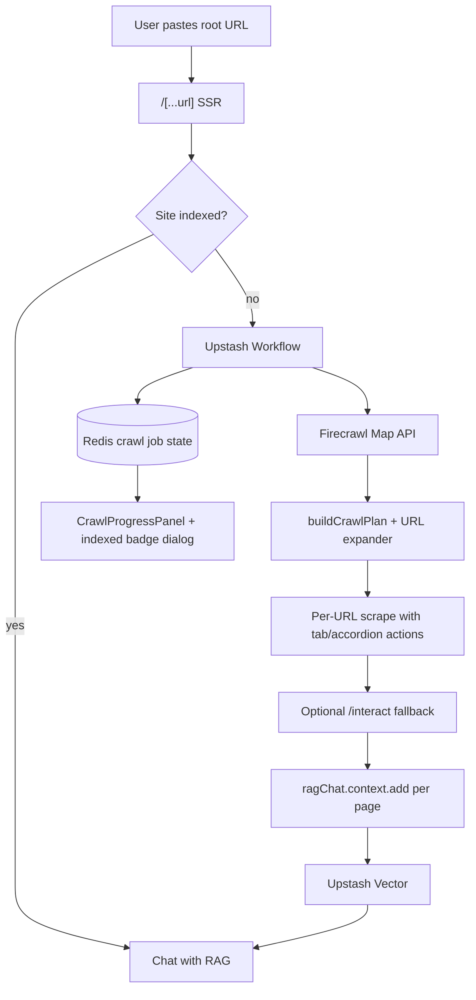

# PROJECT_PLAN — Whole-Site URL RAG Chatbot

**REQ:** REQ-0009…0010 · Phase 3 UX · **REQ-0011 hidden-content harvest (shipped)**  
**Status:** Phase 5 Crawl4AI + agentic pipeline (REQ-0014 / GATE-0014) in progress; Firecrawl remains default crawl
**Last updated:** 2026-08-28

---

## Vision

Turn this repo from a **single-page scraper** into an **open-source, production-style whole-site RAG chatbot**:

> Paste one URL → discover and crawl the entire site (within safe limits) → chat with grounded answers across all indexed pages.

**Differentiators for GitHub:**

- Whole-site ingest (not just the landing page)
- Hybrid crawl: Firecrawl (managed) + Jina fallback + optional self-hosted Crawl4AI
- Multi-provider LLM fallback (Gemini → Groq → OpenRouter → Hugging Face)
- Upstash Vector + Redis + Workflow on Vercel
- SSRF-safe, rate-limited, anonymous sessions

---

## Problem today (resolved)

~~The app ingests **one URL only** via Jina Reader.~~ **Fixed:** Firecrawl whole-site crawl via Upstash Workflow; Jina remains single-page fallback when crawl is not configured.

---

## Target architecture (as-built)



### Stack (hybrid, free-tier friendly)

| Layer | Choice | Role |
| ----- | ------ | ---- |
| URL discovery | Firecrawl Map | List same-origin URLs before crawling |
| Site crawl | Firecrawl scrape + actions | JS-aware Markdown; tab/accordion recipes |
| Complex UI fallback | Firecrawl `/interact` | Low-content or FAQ accordion pages |
| Single-page fallback | Jina Reader (`r.jina.ai`) | When Firecrawl/QStash not configured |
| Async jobs | Upstash Workflow | Durable crawl + embed beyond Vercel timeouts |
| Vector + history | Upstash Vector + Redis | `@upstash/rag-chat` stack |
| LLM | `src/lib/ai/fallback-rag-chat.ts` | Multi-provider fallback chain |
| Self-host (optional) | Crawl4AI on Hetzner/Coolify | Zero SaaS crawl cost for power users |

---

## Dynamic page budget

1. **Map** domain → discovered URL list.
2. **Filter** with `src/lib/url-security.ts` (SSRF, same-origin).
3. **Prioritize** homepage, `/about`, `/contact`, `/resume`, docs paths.
4. **Expand** hash URLs + interaction targets via `buildCrawlPlan` (REQ-0010).
5. **Crawl** `min(eligibleDiscovered, CRAWL_MAX_PAGES)`.
6. **Metadata** per chunk: `Source: {url}`, page title, crawl job id in Redis.

`INDEX_CONTENT_VERSION` = **`site-crawl-v2`** (forces re-crawl vs v1).

---

## Implementation phases

### Phase 1 — Crawl orchestration (REQ-0009) ✅

- ✅ `src/lib/crawl/` — Firecrawl client, map, URL prioritization, per-URL scrape
- ✅ `src/app/api/crawl/workflow/route.ts` — `@upstash/workflow`
- ✅ Redis: `crawl:job:{siteRootKey}` (live job, 7-day TTL) + `crawl:index-meta:{siteRootKey}` (durable snapshot, 90-day TTL)
- ✅ `load-chat-page-data.ts` → start workflow, show crawl progress
- ✅ `CRAWL_PROVIDER=firecrawl|crawl4ai|jina-single` switch
- ✅ Crawl4AI provider (Phase 5 — optional; Firecrawl default)

### Phase 2 — Multi-page RAG indexing ✅

- ✅ `context.add()` per page with `Source: {url}\n\n{markdown}` prefix
- ✅ Namespace = site root (`urlToNamespace(siteRootKey)`)
- ✅ UI: page count in `ChatHeader`, `ChatEmptyState`, indexed-pages dialog on badge click

### Phase 3 — UX + rate limits ✅

- ✅ Live crawl progress: `CrawlProgressPanel`, `/api/crawl/status` poll, `currentPath`, `phaseDetail`
- ✅ Stricter crawl rate limits in `rate-limit.ts`
- ✅ Hero trust rotator (free, anonymous session, local chat list, whole-site RAG)
- ✅ Re-crawl button (`POST /api/crawl/recrawl` — clears vector index, keeps chat history; always invalidates + restarts via `runId`)
- ✅ `/api/crawl/status` session cookie + `allowCrawlStatusPoll` rate limit
- ✅ Index snapshot for revisit (badge/dialog after job TTL expires)

### Phase 4 — OSS / GitHub polish ✅

- ⏳ README demo GIF (URL → crawl → chat) — **deferred** (optional later)
- ✅ Architecture mermaid diagrams in README
- ✅ Sentry (`/api/monitoring` tunnel) + Langfuse chat tracing (REQ-0013 / GATE-0013) — PostHog still **out**
- ✅ Mocked Firecrawl unit tests in default CI (no live key)
- ✅ `CONTRIBUTING.md`, issue templates (`SECURITY.md` already present)
- ✅ Env-tunable rate limits + clearer crawl error UX (REQ-0012 Wave B)
- ✅ Vercel production env (incl. Sentry/Langfuse) + Bot Protection / AI Bots Deny (GATE-0002 Human-Action) — **configured 2026-08-30**

### Phase 5 — Self-hosted Crawl4AI + agentic pipeline ✅

- ✅ `docker/crawl4ai/docker-compose.yml` (+ `.env.example`)
- ✅ `src/lib/crawl/crawl4ai-client.ts` + `scrape-provider.ts` facade
- ✅ `docs/SELF_HOST_CRAWL.md` (Coolify DNS placeholders; no VPS secrets)
- ✅ `services/agentic-pipeline/` — FastAPI 7-stage + MCP + notebooks
- ✅ GATE-0015 multi-agent debate (`/v1/debate`, crawl_qa, boss validator) + `scripts/gen-local-service-env.sh`
- ✅ Agentic fail-closed auth + extractor SSRF (`url_safety.py`)
- ✅ SEO: `src/lib/site.ts` + root metadata / JSON-LD + `opengraph-image.tsx` + landing-only `sitemap.ts`

---

## Remaining / next

| Item | Priority |
| ---- | -------- |
| Optional README demo GIF | Later |
| Observability SaaS extras (PostHog) | Out |
| Coolify DNS for crawl4ai/agents (operator) | After images land |
| `hashLinksFromPage` wiring | Low |

---

## Manual smoke — configured website fixture

### Crawl progress + re-crawl ✅ (verified 2026-08-27)

- Re-crawl from indexed badge → **Crawling X / 17** (monotonic, no batch reset)
- Debug log: `discovered:17` → `crawled:17` → `indexed:17` → `status:completed` (runId `36e1c692-…`)
- Terminal: `POST /api/crawl/recrawl`, many `POST /api/crawl/workflow`, continuous `GET /api/crawl/status`, then `POST /api/chat-stream` after complete
- Long scrape steps (~45–88s) on interact-heavy targets are expected locally

### Hidden-content RAG ✅ (REQ-0011 verified 2026-08-28)

| Area | Result |
| ---- | ------ |
| Resume tabs (`#experience`, Skills click) | ✅ Indexed + chat |
| FAQ (`/faq` Radix accordion) | ✅ Multi-answer harvest (pricing, work permit, Slack/Teams, etc.) |
| Dialog / alert (W3C APG) | ✅ Live harvest PASS |
| Disclosure / Bootstrap collapse / read-more / APG tabs | ✅ Live matrix PASS |

**Implementation:** `src/lib/crawl/expand-harvest.ts` (async settle; no click-all `data-state=closed`); recipes + interact budget 8; `CRAWL_EXPAND_HIDDEN` default on.

**Accepted limits:** CSS-hidden with no control; resume English tab-label recipe is bonus on `/resume|cv|profile` (generic `[role="tab"]` is global).

**Code:** `expand-harvest.ts`, `interaction-recipes.ts`, `scrape-targets.ts`, `CRAWL_INTERACT_MAX_PAGES=8`, `CRAWL_EXPAND_HIDDEN=true` (defaults).

---

## Accounts & API keys

Sign up at these URLs. **Never commit real keys** — use `.env` locally and Vercel env in production.

### Required (core product)

| Service | Where to get key | Env variable |
| ------- | ---------------- | ------------ |
| **Firecrawl** | <https://www.firecrawl.dev/> → Dashboard → API Keys | `FIRECRAWL_API_KEY` |
| **Upstash Redis** | <https://console.upstash.com/redis> → REST API | `UPSTASH_REDIS_REST_URL`, `UPSTASH_REDIS_REST_TOKEN` |
| **Upstash Vector** | <https://console.upstash.com/vector> → Details | `UPSTASH_VECTOR_REST_URL`, `UPSTASH_VECTOR_REST_TOKEN` |
| **Upstash QStash / Workflow** | <https://console.upstash.com/qstash> | `QSTASH_TOKEN`, signing keys |
| **Jina Reader** | <https://jina.ai/reader> | `JINA_API_KEY` (optional but recommended) |
| **Google Gemini** | <https://aistudio.google.com/apikey> | `GEMINI_API_KEY` |
| **Groq** | <https://console.groq.com/keys> | `GROQ_API_KEY` |
| **OpenRouter** | <https://openrouter.ai/keys> | `OPENROUTER_API_KEY` |
| **Hugging Face** | <https://huggingface.co/settings/tokens> | `HUGGINGFACE_API_KEY` |

### Observability (REQ-0013 — shipped)

| Service | URL | Env variables |
| ------- | --- | ------------- |
| Langfuse (server chat traces) | <https://cloud.langfuse.com> | `LANGFUSE_PUBLIC_KEY`, `LANGFUSE_SECRET_KEY`, `LANGFUSE_BASE_URL` |
| Sentry (tunnel `/api/monitoring`) | <https://sentry.io> | `NEXT_PUBLIC_SENTRY_DSN`, `SENTRY_DSN`, `SENTRY_ORG`, `SENTRY_PROJECT`, `SENTRY_AUTH_TOKEN` (upload) |
| PostHog | — | **Not wired** (out of scope) |
| Vercel | <https://vercel.com> | Deploy + env; Bot Protection Challenge + AI Bots Deny enabled |

Portable how-to: `docs/Redis_Sentry_PostHog_INTEGRATION_GUIDE.md` (PostHog section remains reference-only).

---

## Environment variables (crawl extension)

See `.env.example` for full list. Key vars:

```env
FIRECRAWL_API_KEY=
CRAWL_MAX_PAGES=100
CRAWL_PROVIDER=firecrawl
CRAWL_INTERACT_ENABLED=true          # default in code
CRAWL_MAX_ACTIONS_PER_PAGE=8         # default in code
CRAWL_INTERACT_MAX_PAGES=8           # default in code
CRAWL_EXPAND_HIDDEN=true             # default on; set false to disable
QSTASH_TOKEN=
QSTASH_CURRENT_SIGNING_KEY=
QSTASH_NEXT_SIGNING_KEY=
APP_BASE_URL=http://localhost:3000
```

---

## Free-tier limits

| Service | Free tier | Notes |
| ------- | --------- | ----- |
| Firecrawl | ~1,000 credits/month | ~1 credit/page scrape or crawl; map also uses credits |
| Upstash Redis/Vector | Hobby free tier | Watch request counts on demo traffic |
| Upstash Workflow | Pay per step | Keep crawl async; never block SSR |
| Vercel | Hobby limits | Long jobs must use Workflow, not single function |
| LLM providers | Gemini/Groq/OpenRouter `:free` | At least one key required for chat |

---

## GitHub launch checklist

- ⏳ README positions project as **whole-site RAG chatbot**
- ⏳ Demo GIF or screenshot sequence
- ✅ `.env.example` complete (no secrets)
- ⏳ `CONTRIBUTING.md`, `SECURITY.md`
- ⏳ Issue templates (bug, feature)
- ✅ CI: lint + test + build
- ⏳ Optional Firecrawl smoke in CI
- ⏳ Vercel Firewall + production env vars
- ⏳ Rotate any credentials ever pasted in chat or shared files

---

## Success criteria

- ✅ Paste `https://example.com` → multiple pages indexed (about, contact, projects)
- ✅ Q&A returns FAQ **answers** when present in accordions (REQ-0011 harvest + chat smoke)
- ✅ Crawl progress visible; SSRF-safe; rate-limited
- ✅ `npm run lint && npm run test && npm run build` pass
- ⏳ Open-source README explains architecture and free-tier setup clearly

---

## Human actions (before public launch)

1. ✅ Add `FIRECRAWL_API_KEY` locally; add to Vercel production env.
2. ⏳ Enable Upstash Workflow signing keys on Vercel.
3. ⏳ Configure Vercel Firewall per `docs/VERCEL_PRODUCTION_GUARDRAILS.md`.
4. ⏳ **Rotate** any API keys or passwords exposed in chat or `personal-dev-info` files.
5. Live smoke on portfolio site, then commit + deploy.

---

## Related docs

- `CLAUDE.md` — project overview
- `.agile-v/STATE.md` — session checkpoint
- `docs/VERCEL_PRODUCTION_GUARDRAILS.md` — deploy security
- `docs/LLM_MODEL_SELECTION.md` — provider fallback order
