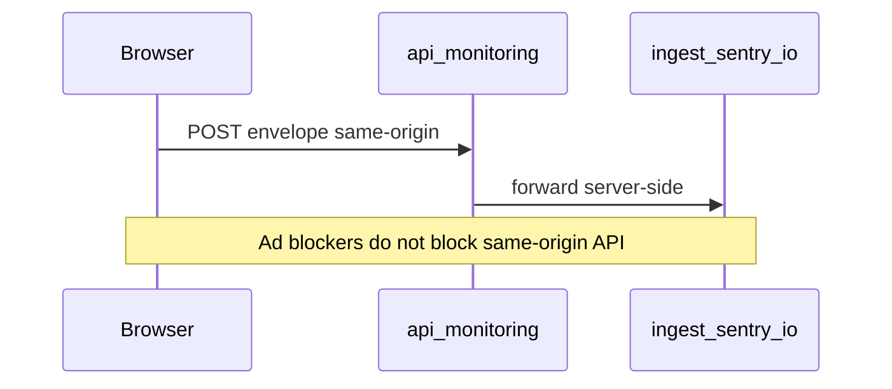

# Integration Guide: Redis, Sentry & PostHog

> **Purpose:** Portable reference — attach this file to any project and follow the stack you use  
> **Reusable:** Next.js App Router **and** Vite + Vercel Functions (SPA)  
> **Portable guide** covering Next.js (§2A), Vite (§2B), and Angular + Vercel (this EmpowerHub repo — see callout under §2).
> Reference implementations differ by stack; prefer `.env.example` for this repository’s env names.  
> **Last updated:** 2026-08-20

---

## Table of Contents

1. [Redis (Upstash)](#1-redis-upstash)
2. [Sentry Error Tracking](#2-sentry-error-tracking)
   - [2A. Next.js (`@sentry/nextjs`)](#2a-nextjs-sentrynextjs)
   - [2B. Vite + Vercel Functions](#2b-vite--vercel-functions)
3. [PostHog Analytics (optional)](#3-posthog-analytics-optional)
4. [Integration Checklist](#integration-checklist)
5. [Troubleshooting](#troubleshooting)

---

## 1. Redis (Upstash)

### Overview

Upstash Redis works in serverless and edge environments. Two common patterns:

| Pattern | Use case |
|---------|----------|
| **A — API response cache** | Cache expensive API/DB reads with TTL |
| **B — Session / state storage** | User sessions, chat history, keyed state with TTL |

Caching should **fail gracefully** — if Redis is down, the app still works.

### Prerequisites

- [Upstash](https://upstash.com) account (free tier available)
- Next.js project

### Step 1: Install

```bash
npm install @upstash/redis
```

### Step 2: Environment variables

```env
UPSTASH_REDIS_URL=https://your-instance.upstash.io
UPSTASH_REDIS_TOKEN=your-token
```

Get from: Upstash Console → your database → REST API.

---

### Pattern A — API response cache

Create `lib/redis.ts`:

```typescript
import { Redis } from "@upstash/redis";

export const redis = new Redis({
  url: process.env.UPSTASH_REDIS_URL || "",
  token: process.env.UPSTASH_REDIS_TOKEN || "",
});

export async function getCache<T>(key: string): Promise<T | null> {
  try {
    return await redis.get<T>(key);
  } catch (error) {
    console.error("Redis get error:", error);
    return null;
  }
}

export async function setCache<T>(
  key: string,
  value: T,
  ttlSeconds?: number
): Promise<void> {
  try {
    if (ttlSeconds) {
      await redis.setex(key, ttlSeconds, value);
    } else {
      await redis.set(key, value);
    }
  } catch (error) {
    console.error("Redis set error:", error);
  }
}

export async function deleteCache(key: string): Promise<void> {
  try {
    await redis.del(key);
  } catch (error) {
    console.error("Redis delete error:", error);
  }
}

/** Consistent key naming — adjust namespaces to your domain */
export const cacheKeys = {
  userProfile: (userId: string) => `user:profile:${userId}`,
  apiSearch: (queryHash: string) => `api:search:${queryHash}`,
  pageData: (slug: string) => `page:${slug}`,
};
```

Wrap API routes:

```typescript
import { NextResponse } from "next/server";
import { getCache, setCache, cacheKeys } from "@/lib/redis";

const TTL = 60 * 30; // 30 minutes

export async function GET() {
  const key = cacheKeys.apiSearch("my-query-hash");
  const cached = await getCache<unknown>(key);
  if (cached) return NextResponse.json(cached);

  const data = await fetchExpensiveData();
  await setCache(key, data, TTL);
  return NextResponse.json(data);
}
```

Invalidate on mutation:

```typescript
import { deleteCache, cacheKeys } from "@/lib/redis";

export async function POST() {
  await updateData();
  await deleteCache(cacheKeys.userProfile("user-123"));
  return NextResponse.json({ ok: true });
}
```

---

### Pattern B — Session / state storage

Extend `lib/redis.ts` for TTL-backed sessions:

```typescript
export interface SessionMessage {
  role: "user" | "assistant";
  content: string;
  timestamp: number;
}

export interface Session {
  id: string;
  messages: SessionMessage[];
  createdAt: number;
  updatedAt: number;
}

export async function getSession(sessionId: string): Promise<Session | null> {
  const data = await redis.get(`session:${sessionId}`);
  if (!data) return null;
  return typeof data === "string" ? JSON.parse(data) : (data as Session);
}

export async function saveSession(
  sessionId: string,
  messages: SessionMessage[],
  ttlSeconds = 60 * 60 * 24 * 30 // 30 days
): Promise<Session> {
  const session: Session = {
    id: sessionId,
    messages,
    createdAt: Date.now(),
    updatedAt: Date.now(),
  };
  await redis.setex(`session:${sessionId}`, ttlSeconds, JSON.stringify(session));
  return session;
}
```

**Optional — hash storage for metadata/vectors:**

```typescript
export async function storeHash(
  key: string,
  field: string,
  value: string
): Promise<void> {
  await redis.hset(key, { [field]: value });
}
```

---

## 2. Sentry Error Tracking

> **This repo (EmpowerHub / employee-management):** Angular SPA + Vercel Functions.
> Use **`SENTRY_DSN`** (baked into `environment.prod.ts` at build), same-origin tunnel at
> **`/api/monitoring`** (`api/monitoring.js` + `api/_lib/sentry/*`), `@sentry/angular` client,
> `@sentry/node` on the API, and quiet post-build `@sentry/cli` upload
> (`tools/sentry-upload-sourcemaps.mjs`). Do **not** rely on Next.js `NEXT_PUBLIC_*` /
> `tunnelRoute` or Vite `VITE_*` as the primary client injection path (aliases are accepted
> as fallbacks only). See `.env.example`.

### Shared goals (both stacks)

- **Client + server** error capture
- **Same-origin tunnel** at `/api/monitoring` — bypasses ad blockers (uBlock, Privacy Badger) in normal and incognito windows
- **Noise filters** — ignore browser extensions / benign quirks (not real app bugs)
- **Quiet CI/Vercel builds** — `silent: true`, `telemetry: false`; delete source maps after upload
- **Disabled when DSN is empty** — safe for local dev without keys
- **No Session Replay / console integration** by default — keeps free-tier overhead low



### Choose your stack

| Stack | Package(s) | Client DSN env | Tunnel mechanism |
|-------|------------|----------------|------------------|
| **Angular SPA + Vercel Functions (this repo)** | `@sentry/angular` + `@sentry/node` + `@sentry/cli` | `SENTRY_DSN` (build-time bake) | Hand-rolled `api/monitoring.js` + `handleTunnelRequest` |
| **Next.js App Router** | `@sentry/nextjs` | `NEXT_PUBLIC_SENTRY_DSN` | `withSentryConfig({ tunnelRoute: "/api/monitoring" })` rewrite |
| **Vite SPA + Vercel Functions** | `@sentry/react` + `@sentry/node` + `@sentry/vite-plugin` | `VITE_SENTRY_DSN` | Hand-rolled `api/monitoring.ts` + `handleTunnelRequest` |

**Do not mix env prefixes:** `NEXT_PUBLIC_*` is ignored by Vite; `VITE_*` is ignored by Next.js client bundling.

### Shared env reference

| Variable | Next.js | Vite | Where to get it |
|----------|---------|------|-----------------|
| Client DSN | `NEXT_PUBLIC_SENTRY_DSN` | `VITE_SENTRY_DSN` | Sentry → Project → Client Keys (DSN) |
| Server DSN | `SENTRY_DSN` (optional alias) | `SENTRY_DSN` (optional alias) | Same DSN; falls back to client DSN |
| `SENTRY_ORG` | Source maps | Source maps | Org Settings → **Organization slug** |
| `SENTRY_PROJECT` | Source maps | Source maps | Project Settings → **Project slug** (not org name) |
| `SENTRY_AUTH_TOKEN` | CI upload | CI upload | Auth Tokens (`project:releases`, `org:read`) |

---

## 2A. Next.js (`@sentry/nextjs`)

### Overview

Lean `@sentry/nextjs` setup for Next.js App Router:

- **Client, server, and edge** runtimes
- Tunnel via Next rewrite (`tunnelRoute`)
- Shared filters + quiet `withSentryConfig` (Step 6b below)

### Prerequisites

- Sentry account (free tier)
- Next.js 15+ App Router
- Node 18+

### Step 1: Install

```bash
npm install @sentry/nextjs
```

### Step 2: Environment variables

```env
# Browser (required for client-side errors)
NEXT_PUBLIC_SENTRY_DSN=https://xxx@xxx.ingest.sentry.io/xxx

# Server alias (optional — falls back to NEXT_PUBLIC_SENTRY_DSN)
SENTRY_DSN=

# Build-time source map upload (Vercel CI — not exposed to browser)
SENTRY_ORG=your-org-slug
SENTRY_PROJECT=your-project-slug
SENTRY_AUTH_TOKEN=your-auth-token
```

| Variable | Where to get it |
|----------|-----------------|
| `NEXT_PUBLIC_SENTRY_DSN` | Sentry → Project Settings → Client Keys (DSN) |
| `SENTRY_ORG` | Sentry → Settings → General |
| `SENTRY_PROJECT` | Project **slug** (not org name) |
| `SENTRY_AUTH_TOKEN` | Sentry → Settings → Auth Tokens (`project:releases`) |

Sentry is **disabled when DSN is empty** — safe for local dev without keys.

---

### Step 3: Shared helpers

#### `lib/sentry-env.ts`

```typescript
export function getClientSentryDsn(): string | undefined {
  const dsn = process.env.NEXT_PUBLIC_SENTRY_DSN?.trim();
  return dsn || undefined;
}

export function getServerSentryDsn(): string | undefined {
  const dsn =
    process.env.SENTRY_DSN?.trim() || process.env.NEXT_PUBLIC_SENTRY_DSN?.trim();
  return dsn || undefined;
}

export function getTracesSampleRate(): number {
  return process.env.NODE_ENV === "production" ? 0.1 : 1.0;
}

/** Same-origin tunnel — bypasses ad blockers blocking ingest.sentry.io */
export const SENTRY_TUNNEL_ROUTE = "/api/monitoring";
```

#### `lib/sentry-filters.ts`

Single source of truth for noise filtering:

```typescript
import type { ErrorEvent } from "@sentry/core";

export const SENTRY_IGNORE_ERRORS: Array<string | RegExp> = [
  "ResizeObserver loop limit exceeded",
  "Non-Error promise rejection captured",
  "Script error.",
  /Loading chunk [\d]+ failed/,
  "top.GLOBALS",
  "AbortError",
  // ... extend as needed
];

const THIRD_PARTY_PATTERNS = [
  /chrome-extension:\/\//i,
  /moz-extension:\/\//i,
  /grammarly/i,
  /googletranslate/i,
];

function isThirdPartyNoise(text: string): boolean {
  return THIRD_PARTY_PATTERNS.some((p) => p.test(text));
}

export function sentryBeforeSend(event: ErrorEvent): ErrorEvent | null {
  const text = JSON.stringify(event.exception ?? event.message ?? "");
  if (isThirdPartyNoise(text)) return null;
  return event;
}
```

**Also configure** Sentry Dashboard → Project Settings → Inbound Filters (ignore errors from browser extensions) as a secondary layer.

---

### Step 4: Runtime config files

#### `sentry.server.config.ts` (Node.js — seed route, RSC)

```typescript
import * as Sentry from "@sentry/nextjs";
import { getServerSentryDsn, getTracesSampleRate } from "./lib/sentry-env";
import { SENTRY_IGNORE_ERRORS, sentryBeforeSend } from "./lib/sentry-filters";

Sentry.init({
  dsn: getServerSentryDsn(),
  enabled: !!getServerSentryDsn(),
  tracesSampleRate: getTracesSampleRate(),
  environment: process.env.NODE_ENV || "development",
  debug: false,
  ignoreErrors: SENTRY_IGNORE_ERRORS,
  beforeSend: sentryBeforeSend,
});
```

#### `sentry.edge.config.ts` (Edge — middleware, edge API routes)

Same as server config — use `getServerSentryDsn()` and shared filters.

---

### Step 5: Instrumentation (required — do NOT use `sentry.client.config.ts`)

#### `instrumentation.ts` (project root)

```typescript
export async function register() {
  if (process.env.NEXT_RUNTIME === "nodejs") {
    await import("./sentry.server.config");
  }
  if (process.env.NEXT_RUNTIME === "edge") {
    await import("./sentry.edge.config");
  }
}

export const onRequestError = async (
  error: unknown,
  request: { path: string; method: string; headers: Record<string, string | string[] | undefined> },
  context: { routerKind: string; routePath: string; routeType: string }
) => {
  const Sentry = await import("@sentry/nextjs");
  Sentry.captureException(error, { extra: { request, context } });
};
```

#### `instrumentation-client.ts` (project root)

Client init via Next.js client instrumentation — **no `layout.tsx` client conversion**:

```typescript
import * as Sentry from "@sentry/nextjs";
import {
  getClientSentryDsn,
  getTracesSampleRate,
  SENTRY_TUNNEL_ROUTE,
} from "./lib/sentry-env";
import { SENTRY_IGNORE_ERRORS, sentryBeforeSend } from "./lib/sentry-filters";

Sentry.init({
  dsn: getClientSentryDsn(),
  enabled: !!getClientSentryDsn(),
  tunnel: SENTRY_TUNNEL_ROUTE,
  tracesSampleRate: getTracesSampleRate(),
  environment: process.env.NODE_ENV || "development",
  debug: false,
  ignoreErrors: SENTRY_IGNORE_ERRORS,
  beforeSend: sentryBeforeSend,
});

export const onRouterTransitionStart = Sentry.captureRouterTransitionStart;
```

---

### Step 6: Tunnel — ad-blocker bypass

Wrap `next.config.ts`:

```typescript
import type { NextConfig } from "next";
import { withSentryConfig } from "@sentry/nextjs";

const nextConfig: NextConfig = {
  // your config
};

export default withSentryConfig(nextConfig, {
  org: process.env.SENTRY_ORG,
  project: process.env.SENTRY_PROJECT,
  authToken: process.env.SENTRY_AUTH_TOKEN,
  tunnelRoute: "/api/monitoring",
  silent: true,
  telemetry: false,
  widenClientFileUpload: true,
  sourcemaps: {
    deleteSourcemapsAfterUpload: true,
  },
  bundleSizeOptimizations: {
    excludeDebugStatements: true,
  },
});
```

**How it works:**

1. Client SDK POSTs to same-origin `/api/monitoring` (not `*.ingest.sentry.io`)
2. `@sentry/nextjs` registers a **Next.js rewrite** at build time
3. Server forwards the envelope to Sentry ingest

**Verify after build:**

```bash
npm run build
# Check .next/routes-manifest.json → rewrites.afterFiles contains /api/monitoring
```

Works in normal browser + incognito when ad blockers are enabled.  
`robots.txt` disallowing `/api/` affects **crawlers only**, not browser SDK POSTs.

---

### Step 6b: Quiet Vercel / CI builds (recommended)

Sentry source map upload and Next.js telemetry can flood deploy logs without adding runtime value. Keep uploads enabled; reduce **log noise only**.

#### `next.config.ts` — Sentry webpack plugin

| Option | Value | Why |
|--------|-------|-----|
| `silent` | `true` | Suppresses per-file source map upload reports in Vercel/CI logs |
| `telemetry` | `false` | Disables Sentry webpack-plugin telemetry banner during build |
| `sourcemaps.deleteSourcemapsAfterUpload` | `true` | **Security:** maps upload to Sentry, then are removed from the deploy artifact |
| `tunnelRoute` | `"/api/monitoring"` | Unchanged — runtime tunnel still works |
| `authToken` + org/project | Set on Vercel | Source maps **still upload** when token is present; logs are just quieter |

```typescript
export default withSentryConfig(nextConfig, {
  org: process.env.SENTRY_ORG,
  project: process.env.SENTRY_PROJECT,
  authToken: process.env.SENTRY_AUTH_TOKEN,
  tunnelRoute: "/api/monitoring",
  silent: true,
  telemetry: false,
  widenClientFileUpload: true,
  sourcemaps: {
    deleteSourcemapsAfterUpload: true,
  },
  bundleSizeOptimizations: {
    excludeDebugStatements: true,
  },
});
```

**Do not** set `silent: !process.env.CI` if you want quiet Vercel builds — on Vercel `CI=1`, that makes logs **more** verbose.

#### `package.json` — Next.js telemetry + npm install noise

```json
{
  "scripts": {
    "build": "NEXT_TELEMETRY_DISABLED=1 next build",
    "postinstall": "update-browserslist-db --quiet"
  },
  "allowScripts": {
    "@sentry/cli": true,
    "sharp": true,
    "unrs-resolver": true,
    "fsevents": true
  },
  "devDependencies": {
    "update-browserslist-db": "^1.2.3"
  }
}
```

| Setting | Purpose |
|---------|---------|
| `NEXT_TELEMETRY_DISABLED=1` | Removes Next.js anonymous telemetry banner from build output |
| `postinstall` + `update-browserslist-db` | Refreshes `caniuse-lite`; avoids “browsers data is N months old” warning |
| `allowScripts` (npm 11+) | Whitelists trusted postinstall scripts (`@sentry/cli`, `sharp`, etc.) — reduces `npm warn allow-scripts` noise |

#### `.npmrc` (optional)

```
fund=false
```

Suppresses `npm fund` messages in CI. Does not affect installs or security.

#### Expected warnings you can ignore (this repo)

| Log line | Meaning |
|----------|---------|
| `Custom Cache-Control headers detected for /_next/static/(.*)` | Intentional immutable caching (see `docs/VERCEL_PRODUCTION_GUARDRAILS.md`) — safe in production |
| `The Edge Runtime is deprecated` | Informational on Next.js 16.3+ when API routes use `export const runtime = "edge"` |
| `Using edge runtime on a page currently disables static generation` | Expected for Edge API routes (`/api/chat`, `/api/history`, etc.) |

These are **not** Sentry or observability failures.

---

### Step 7: Global error boundary

Create `app/global-error.tsx`:

```typescript
"use client";

import * as Sentry from "@sentry/nextjs";
import { useEffect } from "react";

export default function GlobalError({
  error,
  reset,
}: {
  error: Error & { digest?: string };
  reset: () => void;
}) {
  useEffect(() => {
    Sentry.captureException(error);
  }, [error]);

  return (
    <html lang="en">
      <body>
        <h2>Something went wrong</h2>
        <button type="button" onClick={() => reset()}>Try again</button>
      </body>
    </html>
  );
}
```

---

### Step 8: Manual capture in API routes (optional)

```typescript
import * as Sentry from "@sentry/nextjs";

export async function GET() {
  try {
    return Response.json(await fetchData());
  } catch (error) {
    Sentry.captureException(error, { tags: { api_route: "/api/example" } });
    return Response.json({ error: "Internal server error" }, { status: 500 });
  }
}
```

---

### What we intentionally skip (noise, not app bugs)

| Filter | Examples |
|--------|----------|
| `ignoreErrors` | ResizeObserver, Script error., chunk load failures, AbortError |
| `beforeSend` | `chrome-extension://`, Grammarly, Google Translate, MetaMask stacks |
| Not included | Session Replay, console logging integration, profiling |

Real app errors in your code **still report**. Extension-injected errors **do not**.

---

### Deprecated patterns — do NOT use

| Old | Use instead |
|-----|-------------|
| `sentry.client.config.ts` | `instrumentation-client.ts` |
| Sentry init in `layout.tsx` useEffect | Client instrumentation hook |
| `hideSourceMaps: true` | `sourcemaps: { deleteSourcemapsAfterUpload: true }` |
| `disableLogger: true` | `bundleSizeOptimizations: { excludeDebugStatements: true }` |
| Direct ingest URL (no tunnel) | `tunnelRoute` + client `tunnel` option |

---

## 2B. Vite + Vercel Functions

### Overview

Same goals as §2A, adapted for a **Vite CSR SPA** with serverless handlers under `api/` (no `@sentry/nextjs`, no Next rewrite):

- **Client:** `@sentry/react` with `tunnel: "/api/monitoring"`
- **Tunnel:** hand-rolled `api/monitoring.ts` using `@sentry/core` `handleTunnelRequest` (DSN allowlist = SSRF protection)
- **Server:** `@sentry/node` lazy init in API `catch` blocks
- **Source maps:** `@sentry/vite-plugin` only when org/project/token are set; `silent` + delete maps after upload
- Plain `vite` alone cannot serve `/api/*` — use `vercel dev` or a Vercel deploy for tunnel + API capture

**Reference implementation in this repo:** `shared/sentry/`, `src/sentry.ts`, `api/monitoring.ts`, `vite.config.ts`.

### Prerequisites

- Sentry account (free tier)
- Vite + React (or other SPA) on Vercel Functions
- Node 20+ / 24.x recommended

### Step 1: Install

```bash
npm install @sentry/react @sentry/node
npm install -D @sentry/vite-plugin
```

`@sentry/core` (includes `handleTunnelRequest`) comes in transitively.

### Step 2: Environment variables

```env
# Browser (required for client-side errors) — MUST be VITE_ prefix for Vite
VITE_SENTRY_DSN=https://xxx@oXXX.ingest.sentry.io/xxx

# Optional deprecated alias still accepted by some templates:
# VITE_PUBLIC_SENTRY_DSN=

# Server alias (optional — falls back to VITE_SENTRY_DSN)
SENTRY_DSN=

# Build-time source map upload (Vercel CI — not exposed as browser secrets beyond being build env)
SENTRY_ORG=your-org-slug
SENTRY_PROJECT=your-project-slug
SENTRY_AUTH_TOKEN=your-auth-token
```

| Variable | Where to get it |
|----------|-----------------|
| `VITE_SENTRY_DSN` | Sentry → Project Settings → Client Keys (DSN) — must be set on Vercel for **Production build** |
| `SENTRY_DSN` | Same DSN (optional) |
| `SENTRY_ORG` | Sentry → Settings → General → Organization slug |
| `SENTRY_PROJECT` | Project Settings → **Project slug** (not the org name) |
| `SENTRY_AUTH_TOKEN` | Settings → Auth Tokens (`project:releases`, `org:read`) |

**Never use `NEXT_PUBLIC_SENTRY_DSN` in a Vite app** — Vite will not inject it into the client bundle.

Sentry is **disabled when DSN is empty**.

### Step 3: Shared helpers

#### `shared/sentry/constants.ts` (or `src/lib/sentry-constants.ts`)

```typescript
/** Same-origin tunnel — bypasses ad blockers blocking ingest.sentry.io */
export const SENTRY_TUNNEL_ROUTE = "/api/monitoring";
```

#### `shared/sentry/env.ts`

```typescript
export function getClientSentryDsn(): string | undefined {
  try {
    const dsn =
      import.meta.env?.VITE_SENTRY_DSN?.trim() ||
      import.meta.env?.VITE_PUBLIC_SENTRY_DSN?.trim();
    if (dsn) return dsn;
  } catch {
    /* Node api context */
  }
  return (
    process.env.VITE_SENTRY_DSN?.trim() ||
    process.env.VITE_PUBLIC_SENTRY_DSN?.trim() ||
    undefined
  );
}

export function getServerSentryDsn(): string | undefined {
  return (
    process.env.SENTRY_DSN?.trim() ||
    process.env.VITE_SENTRY_DSN?.trim() ||
    process.env.VITE_PUBLIC_SENTRY_DSN?.trim() ||
    undefined
  );
}

/** Tunnel allowlist — only forward envelopes for these DSNs (SSRF-safe). */
export function getAllowedSentryDsns(): string[] {
  return [
    ...new Set(
      [
        process.env.SENTRY_DSN?.trim(),
        process.env.VITE_SENTRY_DSN?.trim(),
        process.env.VITE_PUBLIC_SENTRY_DSN?.trim(),
      ].filter((v): v is string => Boolean(v))
    ),
  ];
}

export function getTracesSampleRate(): number {
  try {
    if (import.meta.env?.PROD) return 0.1;
  } catch {
    /* Node */
  }
  return process.env.NODE_ENV === "production" ? 0.1 : 1.0;
}
```

#### `shared/sentry/filters.ts`

Reuse the same `SENTRY_IGNORE_ERRORS` + `sentryBeforeSend` from §2A Step 3 (copy the Next filter file verbatim — stack-agnostic).

Also enable Sentry Dashboard → Inbound Filters (ignore browser extensions) as a secondary layer.

### Step 4: Client init

#### `src/sentry.ts`

```typescript
import * as Sentry from "@sentry/react";
import {
  getClientSentryDsn,
  getTracesSampleRate,
  SENTRY_IGNORE_ERRORS,
  SENTRY_TUNNEL_ROUTE,
  sentryBeforeSend,
} from "../shared/sentry"; // adjust import path

const dsn = getClientSentryDsn();

Sentry.init({
  dsn,
  enabled: Boolean(dsn),
  tunnel: SENTRY_TUNNEL_ROUTE,
  tracesSampleRate: getTracesSampleRate(),
  ignoreErrors: SENTRY_IGNORE_ERRORS,
  beforeSend: sentryBeforeSend,
  environment: import.meta.env.MODE,
  debug: false,
});

export { Sentry };
```

#### `src/main.tsx` — import Sentry **before** App

```tsx
import React from "react";
import ReactDOM from "react-dom/client";
import { Sentry } from "./sentry";
import App from "./App";
import "./index.css";

ReactDOM.createRoot(document.getElementById("root")!).render(
  <React.StrictMode>
    <Sentry.ErrorBoundary
      fallback={
        <div style={{ padding: "2rem", fontFamily: "system-ui" }}>
          Something went wrong. Please refresh the page.
        </div>
      }
      showDialog={false}
    >
      <App />
    </Sentry.ErrorBoundary>
  </React.StrictMode>
);
```

Declare `VITE_SENTRY_DSN?: string` on `ImportMetaEnv` in `src/vite-env.d.ts`.

### Step 5: Tunnel API (`api/monitoring.ts`)

Next.js registers the tunnel via rewrite. On Vite + Vercel you **own** the handler:

```typescript
import type { VercelRequest, VercelResponse } from "@vercel/node";
import { handleTunnelRequest } from "@sentry/core";
import { getAllowedSentryDsns } from "../shared/sentry/env";
// optional: soft IP rate limit to avoid open-proxy abuse

function envelopeFromBody(body: unknown): string | null {
  if (typeof body === "string" && body.length > 0) return body;
  if (Buffer.isBuffer(body) && body.length > 0) return body.toString("utf8");
  if (body instanceof Uint8Array && body.length > 0) {
    return Buffer.from(body).toString("utf8");
  }
  return null;
}

export default async function handler(req: VercelRequest, res: VercelResponse) {
  if (req.method !== "POST") {
    return res.status(405).json({ error: "Method not allowed" });
  }

  const allowedDsns = getAllowedSentryDsns();
  if (allowedDsns.length === 0) {
    return res.status(204).end(); // soft no-op when unset
  }

  const envelope = envelopeFromBody(req.body);
  if (!envelope) {
    return res.status(400).json({ error: "Empty envelope" });
  }

  try {
    const upstream = await handleTunnelRequest({
      request: new Request("http://localhost/api/monitoring", {
        method: "POST",
        headers: {
          "content-type":
            (req.headers["content-type"] as string) ||
            "application/x-sentry-envelope",
        },
        body: envelope,
      }),
      allowedDsns,
    });

    const text = await upstream.text();
    res.status(upstream.status);
    const contentType = upstream.headers.get("content-type");
    if (contentType) res.setHeader("Content-Type", contentType);
    return res.send(text);
  } catch {
    return res.status(502).json({ error: "Tunnel forward failed" });
  }
}
```

**How it works:**

1. Client SDK POSTs to same-origin `/api/monitoring` (not `*.ingest.sentry.io`)
2. Handler allowlists envelope DSN, then forwards to Sentry ingest
3. Ad blockers that block Sentry hosts never see the outbound browser request

Works in normal browser + incognito with ad blockers enabled.  
`robots.txt` `Disallow: /api/` affects **crawlers only**, not browser SDK POSTs.

### Step 6: Quiet Vite builds + source maps

#### `vite.config.ts`

```typescript
import { defineConfig, loadEnv } from "vite";
import react from "@vitejs/plugin-react";
import { sentryVitePlugin } from "@sentry/vite-plugin";

export default defineConfig(({ mode }) => {
  const env = loadEnv(mode, process.cwd(), "");
  const org = env.SENTRY_ORG?.trim();
  const project = env.SENTRY_PROJECT?.trim();
  const authToken = env.SENTRY_AUTH_TOKEN?.trim();
  const enableSentryUpload = Boolean(org && project && authToken);

  return {
    plugins: [
      react(),
      ...(enableSentryUpload
        ? [
            sentryVitePlugin({
              org,
              project,
              authToken,
              silent: true,       // quiet Vercel / CI logs
              telemetry: false,   // no Sentry plugin telemetry banner
              sourcemaps: {
                filesToDeleteAfterUpload: ["./dist/**/*.map"],
              },
            }),
          ]
        : []),
    ],
    build: {
      // Only emit maps when upload is configured (then delete after upload)
      sourcemap: enableSentryUpload,
    },
  };
});
```

| Option | Value | Why |
|--------|-------|-----|
| `silent` | `true` | Suppresses per-file upload spam in deploy logs |
| `telemetry` | `false` | Disables Sentry plugin telemetry |
| `filesToDeleteAfterUpload` | `./dist/**/*.map` | Maps go to Sentry, not public CDN artifacts |
| Plugin omitted when token missing | — | Build stays green without Sentry CI secrets |

### Step 7: Server capture helper

#### `shared/sentry/server.ts`

```typescript
import * as Sentry from "@sentry/node";
import { getServerSentryDsn, getTracesSampleRate } from "./env";
import { SENTRY_IGNORE_ERRORS, sentryBeforeSend } from "./filters";

let initialized = false;

export function initServerSentry(): void {
  if (initialized) return;
  initialized = true;
  const dsn = getServerSentryDsn();
  Sentry.init({
    dsn,
    enabled: Boolean(dsn),
    tracesSampleRate: getTracesSampleRate(),
    ignoreErrors: SENTRY_IGNORE_ERRORS,
    beforeSend: sentryBeforeSend,
    debug: false,
  });
}

export function captureApiException(
  error: unknown,
  tags?: Record<string, string>
): void {
  initServerSentry();
  if (!getServerSentryDsn()) return;
  Sentry.captureException(error, tags ? { tags } : undefined);
}
```

**Do not** re-export `server.ts` from a client-safe barrel — it pulls `@sentry/node` into the browser bundle.

### Step 8: Manual capture in API routes

```typescript
import { captureApiException } from "../shared/sentry/server";

export default async function handler(req, res) {
  try {
    // ...
  } catch (error) {
    captureApiException(error, { api_route: "/api/chat" });
    return res.status(500).json({ error: "Internal server error" });
  }
}
```

### What we intentionally skip (same as Next)

| Filter | Examples |
|--------|----------|
| `ignoreErrors` | ResizeObserver, Script error., chunk load failures, AbortError |
| `beforeSend` | `chrome-extension://`, Grammarly, Google Translate |
| Not included | Session Replay, console logging integration, profiling |

### Deprecated / wrong for Vite — do NOT use

| Wrong | Use instead |
|-------|-------------|
| `@sentry/nextjs` / `withSentryConfig` | `@sentry/react` + `api/monitoring.ts` |
| `NEXT_PUBLIC_SENTRY_DSN` | `VITE_SENTRY_DSN` |
| Direct browser POSTs to `*.ingest.sentry.io` | `tunnel: "/api/monitoring"` |
| Leaving `*.map` in `dist/` | `filesToDeleteAfterUpload` |
| Importing `shared/sentry/server` from client | Separate server-only import path |

---

## 3. PostHog Analytics (optional)

> **Optional — copy when needed.** Not required in every project. The FAQ chatbot reference repo does **not** ship PostHog wired by default.

### Overview

Product analytics, feature flags, session replay. Client-side tracking via `posthog-js`.

### Prerequisites

- PostHog account (free tier)
- Next.js project

### Step 1: Install

```bash
npm install posthog-js
```

### Step 2: Environment variables

```env
NEXT_PUBLIC_POSTHOG_KEY=phc_xxx
NEXT_PUBLIC_POSTHOG_HOST=https://eu.i.posthog.com
```

Use `https://app.posthog.com` for US region.

### Step 3: Client library

Create `lib/posthog.ts`:

```typescript
import posthog from "posthog-js";

export function initPostHog(): void {
  if (typeof window === "undefined") return;

  const key = process.env.NEXT_PUBLIC_POSTHOG_KEY;
  const host = process.env.NEXT_PUBLIC_POSTHOG_HOST;
  if (!key || !host) return;

  posthog.init(key, {
    api_host: host,
    capture_pageview: false, // manual pageviews in App Router
    loaded: (ph) => {
      if (process.env.NODE_ENV === "development") ph.debug();
    },
  });
}

export function trackEvent(name: string, properties?: Record<string, unknown>) {
  if (typeof window !== "undefined" && posthog.__loaded) {
    posthog.capture(name, properties);
  }
}
```

### Step 4: Provider (client component)

Create `components/providers/posthog-provider.tsx`:

```typescript
"use client";

import { useEffect } from "react";
import { usePathname, useSearchParams } from "next/navigation";
import posthog from "posthog-js";
import { initPostHog } from "@/lib/posthog";

export function PostHogProvider({ children }: { children: React.ReactNode }) {
  const pathname = usePathname();
  const searchParams = useSearchParams();

  useEffect(() => {
    initPostHog();
  }, []);

  useEffect(() => {
    if (pathname && posthog.__loaded) {
      posthog.capture("$pageview", { $current_url: window.location.href });
    }
  }, [pathname, searchParams]);

  return <>{children}</>;
}
```

Add to `app/providers.tsx` (inside existing client providers):

```typescript
import { PostHogProvider } from "@/components/providers/posthog-provider";

export function Providers({ children }: { children: React.ReactNode }) {
  return (
    <PostHogProvider>
      {/* other providers */}
      {children}
    </PostHogProvider>
  );
}
```

### Ad-blocker note

PostHog ingest domains can be blocked like Sentry. For production, consider a [reverse proxy / first-party host](https://posthog.com/docs/advanced/proxy) so events use your domain.

---

## Integration Checklist

### Redis

- [ ] Install `@upstash/redis`
- [ ] Set `UPSTASH_REDIS_URL` and `UPSTASH_REDIS_TOKEN`
- [ ] Create `lib/redis.ts` (Pattern A and/or B)
- [ ] Graceful error handling (cache miss on failure)
- [ ] Invalidate cache keys on mutations

### Sentry — Next.js (§2A)

- [ ] Install `@sentry/nextjs`
- [ ] Set env vars (`NEXT_PUBLIC_SENTRY_DSN` minimum)
- [ ] Create `lib/sentry-env.ts` and `lib/sentry-filters.ts`
- [ ] Create `sentry.server.config.ts` and `sentry.edge.config.ts`
- [ ] Create `instrumentation.ts` with `register` + `onRequestError`
- [ ] Create `instrumentation-client.ts` with tunnel + `onRouterTransitionStart`
- [ ] Wrap `next.config.ts` with `withSentryConfig` + `tunnelRoute: "/api/monitoring"`
- [ ] Set `silent: true` and `telemetry: false` for quiet CI/Vercel builds (Step 6b)
- [ ] Set `NEXT_TELEMETRY_DISABLED=1` on build script; optional `.npmrc` + `allowScripts`
- [ ] Create `app/global-error.tsx`
- [ ] Verify tunnel rewrite in `.next/routes-manifest.json` after build
- [ ] Set Vercel env vars for production + source maps
- [ ] Test: real error appears in dashboard; extension noise does not

### Sentry — Vite + Vercel Functions (§2B)

- [ ] Install `@sentry/react`, `@sentry/node`, `@sentry/vite-plugin`
- [ ] Set `VITE_SENTRY_DSN` (not `NEXT_PUBLIC_*`); optional `SENTRY_DSN`
- [ ] Create shared `constants` / `env` / `filters` (+ server helper)
- [ ] Create `src/sentry.ts` with `tunnel: "/api/monitoring"`; import before App
- [ ] Wrap root with `Sentry.ErrorBoundary`
- [ ] Add `api/monitoring.ts` using `handleTunnelRequest` + DSN allowlist
- [ ] Wire `captureApiException` in API `catch` blocks
- [ ] Configure `sentryVitePlugin` with `silent: true`, `telemetry: false`, delete maps after upload
- [ ] Set Vercel `VITE_SENTRY_DSN` for Production **build**; org/project/token for maps
- [ ] Test with ad blocker: Network shows `POST /api/monitoring`; event appears in Sentry

### PostHog (optional)

- [ ] Install `posthog-js`
- [ ] Set `NEXT_PUBLIC_POSTHOG_KEY` and `NEXT_PUBLIC_POSTHOG_HOST`
- [ ] Create `lib/posthog.ts` and provider
- [ ] Verify events in PostHog dashboard
- [ ] Consider reverse proxy for ad-blocker resilience

---

## Troubleshooting

### Sentry

| Issue | Fix |
|-------|-----|
| Events blocked with ad blocker (Next) | Ensure `tunnelRoute` in `next.config.ts` **and** `tunnel` in client init match (`/api/monitoring`) |
| Events blocked with ad blocker (Vite) | Ensure `tunnel: "/api/monitoring"` in `Sentry.init` **and** `api/monitoring.ts` is deployed (`vercel dev` / production) |
| Tunnel 404 (Next) | Rebuild; check `routes-manifest.json` rewrites |
| Tunnel 404 (Vite) | Confirm `api/monitoring.ts` exists; plain `vite` does not serve `/api/*` |
| No client events (Next) | Set `NEXT_PUBLIC_SENTRY_DSN` on Vercel at **build** time |
| No client events (Vite) | Set `VITE_SENTRY_DSN` on Vercel at **build** time (not `NEXT_PUBLIC_*`) |
| Wrong Vite env name | Rename `NEXT_PUBLIC_SENTRY_DSN` / prefer `VITE_SENTRY_DSN` over `VITE_PUBLIC_SENTRY_DSN` |
| No source maps | Set `SENTRY_AUTH_TOKEN`, `SENTRY_ORG`, `SENTRY_PROJECT` in CI/Vercel; use **project** slug |
| Verbose Sentry upload log (Next) | `silent: true` + `telemetry: false` in `withSentryConfig` |
| Verbose Sentry upload log (Vite) | Same flags on `sentryVitePlugin` |
| Next.js telemetry banner | Add `NEXT_TELEMETRY_DISABLED=1` to `build` script |
| `Browserslist: browsers data is N months old` | Add `update-browserslist-db` postinstall (Next Step 6b) |
| Too much noise (extensions) | Expand filters; enable Sentry Inbound Filters |
| False errors from tunnel when DSN empty | Handler should return `204` (soft no-op), not `500` |
| Sentry disabled locally | Expected when DSN empty — set DSN to test |
| `@sentry/node` in browser bundle | Do not import `server.ts` from client entry |

### Redis

| Issue | Fix |
|-------|-----|
| Connection errors | Verify URL/token; check Upstash dashboard |
| Stale cache | Reduce TTL or invalidate on write |

### PostHog

| Issue | Fix |
|-------|-----|
| Events not tracking | Check API key and host region |
| Blocked by ad blocker | Use reverse proxy / first-party host |

---

## References

- [Sentry Next.js Docs](https://docs.sentry.io/platforms/javascript/guides/nextjs/)
- [Sentry React Docs](https://docs.sentry.io/platforms/javascript/guides/react/)
- [Sentry Vite Plugin](https://docs.sentry.io/platforms/javascript/sourcemaps/uploading/vite/)
- [Sentry tunnel / troubleshooting](https://docs.sentry.io/platforms/javascript/troubleshooting/#using-the-tunnel-option)
- [Upstash Redis Docs](https://upstash.com/docs/redis)
- [PostHog Next.js Docs](https://posthog.com/docs/libraries/next-js)
